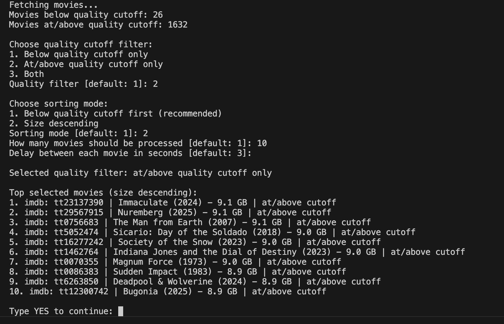
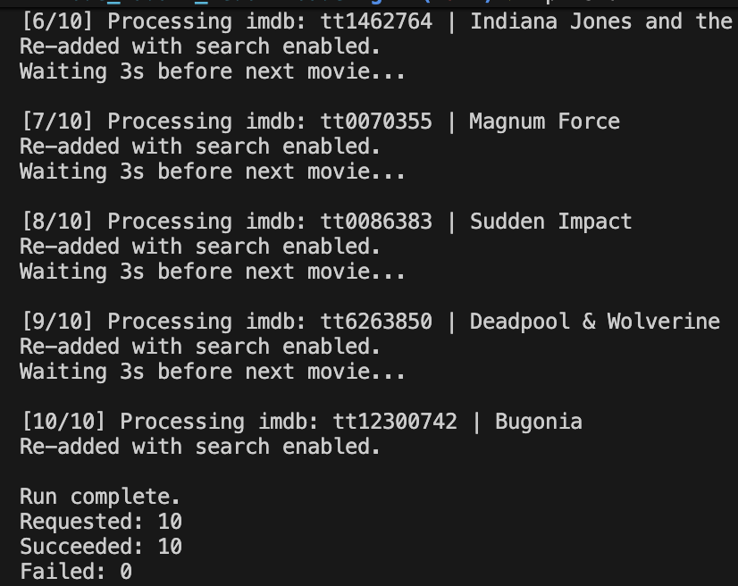

# Node Radarr Redownloader

[](https://github.com/harryhax/node_radarr_redownloader/releases)
[](https://github.com/harryhax/node_radarr_redownloader/actions/workflows/release.yml)
[](https://nodejs.org/en/download)
[](https://github.com/harryhax/node_radarr_redownloader/blob/main/LICENSE)
[](https://github.com/harryhax/node_radarr_redownloader/releases)


Node Radarr Redownloader is a CLI that refreshes selected movies after Radarr profile or rule changes. You can choose a quality-cutoff filter (below, at/above, or both) and a sorting mode (below-cutoff-first or size) before each run. The tool then deletes and re-adds movies with search enabled so new grabs follow your current quality rules, processing one movie at a time with a delay and IMDb-first identifiers to avoid title ambiguity.

## Screenshots 




## Details

1. Fetches all Radarr movies
2. Shows counts for movies below cutoff and at/above cutoff
3. Asks you to choose quality filter (below cutoff, at/above cutoff, or both)
4. Lets you choose how many to process
5. Asks you to choose sorting mode (below quality cutoff first, or size descending)
6. For each movie, stores imdb/title in memory (IMDb first), deletes the movie with files, and adds it back with search enabled
7. Waits between each movie so Radarr can catch up

## Project Structure

- `index.js`: Main CLI entry point and high-level flow
- `src/config.js`: Environment variable parsing and defaults
- `src/radarrApi.js`: Radarr API client and error handling
- `src/prompts.js`: Interactive user prompt helpers
- `src/movieWorkflow.js`: Delete/re-add processing loop logic
- `src/utils.js`: Shared utility helpers (delay, size formatting)

## Requirements

- Node.js 18+ (minimum)
- Radarr v3+ with API v3 endpoints enabled (minimum)
- Radarr API key

Download links:

- Node.js: https://nodejs.org/en/download
- Radarr: https://radarr.video/#download

## Setup

1. Copy `.env.example` values into your shell environment.
2. Set at least:
   - `RADARR_URL`
   - `RADARR_API_KEY`

Optional fallback values:

- `RADARR_DEFAULT_QUALITY_PROFILE_ID`
- `RADARR_DEFAULT_ROOT_FOLDER_PATH`

## Run

```bash
RADARR_URL=http://localhost:7878 \
RADARR_API_KEY=your_api_key_here \
node index.js
```

or

```bash
npm start
```

## Standalone Binaries (Windows, Linux, macOS)

This project can be compiled to standalone executables so users do not need Node.js installed.

Build for your current machine:

```bash
npm run build:current
```

Build all targets (win-x64, linux-x64, macos-x64, macos-arm64):

```bash
npm run build:all
```

Compiled files are written to `dist/`.

Running compiled binaries:

- Linux/macOS: run the file from `dist/` directly
- Windows: run the `.exe` file from `dist/`

Environment variables are still required for API access (`RADARR_URL`, `RADARR_API_KEY`, and optional fallback variables).

## Automated GitHub Releases (Actions)

This repository includes a GitHub Actions workflow at `.github/workflows/release.yml`.

How it works:

1. Push a version tag like `v1.0.1`.
2. Actions builds binaries for Windows, Linux, and macOS.
3. Actions creates or updates the matching GitHub Release.
4. Built binaries are uploaded as release assets for download.

Manual trigger option:

- In GitHub Actions, run `Build And Publish Release` and provide `release_tag`.

## Important

- Heads up: this script removes existing movie entries and files before re-adding them, so use it only for movies you intentionally want to refresh.
- It asks for explicit `YES` confirmation before making changes.
- If re-add fails for a movie, that movie may remain deleted and will be shown in the failure summary.
- Failed items are also appended to `logs/failed-movies.log` so you can track what still needs to be re-added or downloaded.
